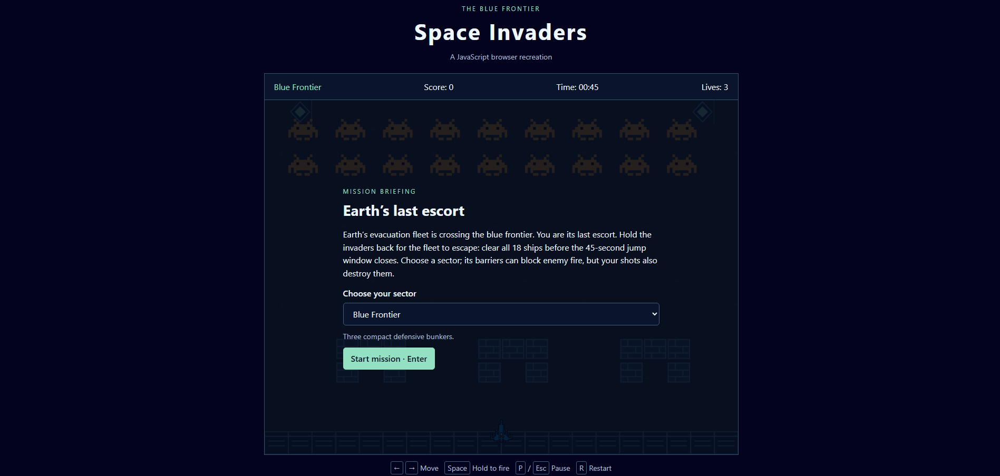

# Space Invaders: JavaScript Browser Recreation

A single-player browser recreation of Space Invaders, built with plain JavaScript and DOM elements. Protect Earth’s evacuation fleet by destroying 18 invaders before a 45-second jump window closes. The game retains the original blue space background, ship sprites, and shooting sounds, with a coordinated mission briefing, HUD, menus, and scoreboard.



## Gameplay

- **Arcade action:** hold to move and fire as you face a descending formation of invaders. Clear all 18 ships in 45 seconds with three lives.
- **Three playable sectors:** defend Blue Frontier, Relay Station, or Last Outpost, each with a different shield layout.
- **Destructible shields:** take cover from enemy fire, but choose your shots carefully — both sides can destroy your protection.
- **Story progression:** escort Earth’s evacuation fleet through a mission briefing, a mid-game story moment, and a victory or defeat ending.
- **Persistent leaderboard:** save your name and score, browse ranked results, and see your position and top percentage.
- **Pause and restart:** take a break or begin a fresh attempt using the keyboard.

## Technologies

JavaScript, HTML, CSS, SVG, and Go.

Built a custom DOM-based game engine without frameworks or canvas, with a Go service for persistent scores.

## Run locally

Install Go **1.22 or newer** and use a modern desktop browser. From the repository root:

```sh
go run ./server
```

Open **http://127.0.0.1:8080**. The Go process serves both the game and the score API, so a separate frontend server or build step is unnecessary. Opening `index.html` directly with `file://` will not run the module-based game correctly.

## Controls

| Key | Action |
| --- | --- |
| Left / Right arrows | Hold to move |
| Space | Hold to fire |
| P / Escape | Pause or continue |
| R | Reset the current mission and return to its briefing |
| Enter | Start or continue the story waypoint |
| Tab / Shift+Tab, Enter / Space | Navigate and activate menu controls |

Use the sector selector in the briefing. From the pause menu, **Change sector** returns to the briefing and clears the current attempt. Restarting keeps the selected sector but restores its original barriers. Abandoned attempts are not scored; completed attempts are saved only after entering a name and choosing **Save score**. Save before restarting to retain the result. Typing in the name field or using the selector does not trigger game shortcuts.

## Contributors

Original repository contributors, preserved from Git history:

- **ihamzaihsan**
- **hussainali2**

The existing artwork and sounds are retained from the repository; no additional ownership or licensing claims are made.
